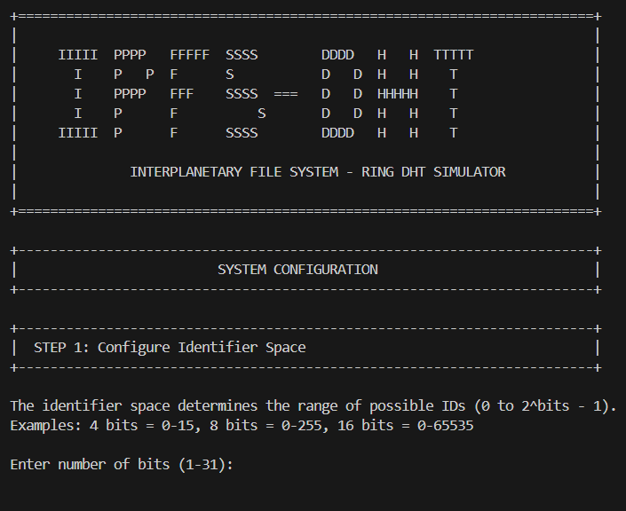

# IPFS Ring DHT Simulator

[](https://en.cppreference.com/w/cpp/17)
[](https://www.microsoft.com/windows)
[](LICENSE)

A C++ implementation of a Ring-based Distributed Hash Table (DHT) simulating IPFS file storage. This project demonstrates key distributed systems concepts including consistent hashing, finger tables for O(log N) routing, and B-tree based local storage.



## Features

- **Configurable Identifier Space**: Support for 1-31 bit identifier spaces (2 to 2^31 possible IDs)
- **Dynamic Machine Operations**: Add/remove machines without disrupting the DHT
- **O(log N) Routing**: Finger table implementation for efficient key lookup
- **B-Tree Storage**: Each machine stores files in a B-tree for efficient local operations
- **File Operations from Any Machine**: Insert, search, and delete files starting from any machine
- **Complete Routing Path Display**: Shows the path taken during file operations
- **SHA-1 Hashing**: Consistent hashing for file and machine IDs

## System Requirements

- **OS**: Windows 10/11
- **Compiler**: MinGW-w64 (g++ 9.0+) or MSVC
- **C++ Standard**: C++17
- **Build Tools**: Make or CMake 3.15+
- **IDE** (optional): VS Code with C/C++ extension

## Quick Start

### Prerequisites

#### Installing MinGW-w64 (Recommended)

1. Download MSYS2 from https://www.msys2.org/
2. Run the installer and follow the prompts
3. Open MSYS2 terminal and run:
   ```bash
   pacman -S mingw-w64-x86_64-gcc mingw-w64-x86_64-make
   ```
4. Add to Windows PATH: `C:\msys64\mingw64\bin`

### Building from Terminal

#### Using Makefile (Recommended)

```powershell
# Clone or download the project
cd ipfs-ring-dht

# Build the project
make

# Run the program
make run

# Or run directly
.\bin\ipfs_dht.exe
```

#### Using CMake

```powershell
# Create build directory
mkdir build
cd build

# Generate build files
cmake -G "MinGW Makefiles" ..

# Build
cmake --build .

# Run (from project root)
cd ..
.\bin\ipfs_dht.exe
```

#### Direct Compilation

```powershell
# Create output directory
mkdir bin

# Compile
g++ -std=c++17 -Wall -Wextra -O2 src/main.cpp -o bin/ipfs_dht.exe

# Run
.\bin\ipfs_dht.exe
```

### VS Code Setup

1. Open the project folder in VS Code
2. Install the "C/C++" extension (`ms-vscode.cpptools`)
3. Press `Ctrl+Shift+B` to build
4. Press `F5` to debug (requires debug build)

## Usage Guide

### Initial Setup

When you start the program, you'll be prompted to configure:

1. **Identifier Space (Bits)**: Number of bits for IDs (1-31)
   - 4 bits = IDs 0-15
   - 8 bits = IDs 0-255
   - 16 bits = IDs 0-65535

2. **B-Tree Order**: How many keys per B-tree node (3-100)
   - Recommended: 5 for small systems

3. **Initial Machines**: Number of machines to add initially

4. **ID Assignment Method**:
   - Manual: Enter each ID
   - Automatic: Hash machine names
   - Random: Generate random IDs

### Menu Options

| Option | Description |
|--------|-------------|
| 1 | Add new machine to the ring |
| 2 | Remove machine (files redistributed) |
| 3 | Insert file(s) from a specified machine |
| 4 | Search for a file (shows routing path) |
| 5 | Delete a file (shows routing path) |
| 6 | Print routing table for a machine |
| 7 | Print B-tree for a machine |
| 8 | Print all routing tables |
| 9 | Print all B-trees |
| 10 | View system status |
| 11 | Restart system |
| 0 | Exit |

### Example Session

```
1. Configure: 4 bits (IDs 0-15), B-tree order 5
2. Add machines: 1, 4, 7, 12, 15 (manual IDs)
3. Insert file "data/test.txt" from machine 1
   → Shows: 1 → 4 → 7 (STORED)
4. Search from machine 15
   → Shows: 15 → 1 → 4 → 7 (FOUND)
```

## Project Structure

```
ipfs-ring-dht/
├── .vscode/                    # VS Code configuration
│   ├── c_cpp_properties.json   # IntelliSense settings
│   ├── tasks.json              # Build tasks
│   └── launch.json             # Debug configuration
│
├── src/                        # Source code
│   ├── main.cpp                # Main entry point
│   ├── IPFS.h                  # IPFS DHT class
│   ├── CircularLL.h            # Circular linked list (ring)
│   ├── DoublyLL.h              # Doubly linked list (routing table)
│   ├── BTree.h                 # B-tree implementation
│   ├── Queue.h                 # Queue for BFS
│   ├── SHA1.h                  # SHA-1 hash function
│   └── Menu.h                  # User interface
│
├── data/                       # Data files
│   └── sample_files/           # Sample test files
│
├── docs/                       # Documentation
│   ├── DESIGN.md               # Design documentation
│   └── screenshots/            # Screenshots
│
├── bin/                        # Compiled binaries
│
├── Makefile                    # Make build system
├── CMakeLists.txt              # CMake build system
├── .gitignore                  # Git ignore rules
├── README.md                   # This file
└── LICENSE                     # MIT License
```

## Technical Details

### Data Structures

1. **Circular Linked List**: Ring of machines, sorted by ID
2. **Doubly Linked List**: Routing table (finger table) for each machine
3. **B-Tree**: File storage on each machine

### Algorithms

- **Consistent Hashing**: SHA-1 based hashing with modulo for identifier space
- **Finger Table Routing**: O(log N) lookup using FT[i] = succ(n + 2^i)
- **File Distribution**: Files stored on successor of their hash

### Limitations

- **31-bit maximum**: Due to int size limits in C++
- **Single-threaded**: No concurrent operations
- **In-memory only**: No persistent storage

## Troubleshooting

### "make is not recognized"
- Ensure MinGW is installed and added to PATH
- Try using `mingw32-make` instead of `make`

### "g++ is not recognized"
- Add `C:\msys64\mingw64\bin` to your Windows PATH
- Restart your terminal after changing PATH

### Build errors
- Ensure you're using C++17: `g++ -std=c++17 ...`
- Check that all source files are present in `src/`

## Contributing

1. Fork the repository
2. Create your feature branch (`git checkout -b feature/amazing`)
3. Commit your changes (`git commit -m 'Add amazing feature'`)
4. Push to the branch (`git push origin feature/amazing`)
5. Open a Pull Request

## License

This project is licensed under the MIT License - see the [LICENSE](LICENSE) file for details.

## Acknowledgments

- Course: Data Structures
- Based on Chord DHT protocol concepts
- SHA-1 implementation adapted for educational purposes

## Authors

- Ayishah (https://github.com/Ayishahh)
- Maryam Farooq (https://github.com/maryammFarooq)
---

*This is an educational project demonstrating distributed hash table concepts.*
